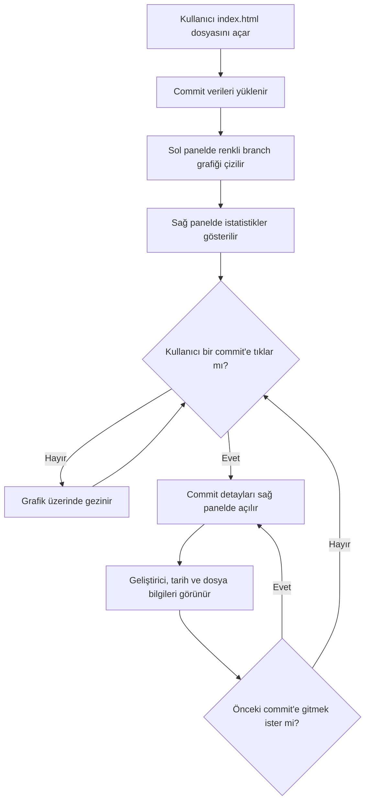

# ⎇ Git Geçmişi Görselleştiricisi

### Yazılım Geliştiriciler için İnteraktif Commit Takip Aracı

`Tek dosya` `Kurulum yok` `Tarayıcıda çalışır`

---

## 🎯 Bu Proje Nedir?

Yazılım projelerinde birden fazla geliştirici aynı anda farklı özellikler üzerinde çalışır. Bu süreçte kimin ne zaman ne değiştirdiğini, hangi dalın ne zaman açıldığını ve nerede birleştirildiğini takip etmek giderek zorlaşır.

**Git Geçmişi Görselleştiricisi**, bir yazılım projesinin tüm commit geçmişini, branch yapısını ve geliştirici katkılarını sade ve anlaşılır bir grafik üzerinde gösterir.

---

## 🤔 Neden Bu Aracı Kullanmalısınız?

GitHub'ın kendi commit geçmişi arayüzü vardır — ancak karmaşık ve teknik bilgi gerektirir. Bu araç ise:

- **Tek tıkla detay gösterir** — bir commit'e tıklayınca kim yaptı, ne zaman, hangi dosyalar değişti hemen görünür
- **Renkli branch gösterimi** — hangi dalın nerede ayrıldığı ve birleştiği net bir şekilde görülür
- **Kurulum gerektirmez** — sadece `index.html` dosyasını tarayıcıda aç, hepsi bu
- **Herkese açık** — GitHub Pages üzerinden direkt paylaşılabilir

---

## 👥 Hedef Kitle

| Kullanıcı | Kullanım Amacı |
|---|---|
| Yazılım öğrencileri | Git'i öğrenirken commit/branch kavramlarını görsel olarak anlamak |
| Junior geliştiriciler | Takım projelerinde geçmişi takip etmek |
| Yazılım ekipleri | Projenin zaman içindeki gelişimini sunmak |

Bu kullanıcılar zaten GitHub'a girer — projeyi direkt açabilirler, ekstra kurulum gerekmez.

---

## ✨ Özellikler

- 🌿 **Branch görselleştirme** — her dal farklı renkte gösterilir
- 🔵 **Commit detayı** — tıklayınca geliştirici, tarih ve değişen dosyalar görünür
- 🔀 **Merge geçmişi** — hangi dalın nerede birleştiğini gösterir
- 🏷 **Release işareti** — sürüm çıkış noktaları özel simgeyle gösterilir
- 📂 **Dosya değişimleri** — eklenen / değiştirilen / silinen dosyalar renkli gösterilir
- 🔗 **Commit bağlantıları** — önceki commit'e tıklayarak geçmişte gezebilirsin

---

## 🚀 Nasıl Çalışır?

### Adım 1 — Dosyayı aç
```
index.html dosyasını tarayıcıda aç
```

### Adım 2 — Grafiği incele
Sol tarafta renkli çizgilerle branch yapısı görünür. Her nokta bir commit'i temsil eder.

### Adım 3 — Commit'e tıkla
Herhangi bir commit noktasına tıklayınca sağ panelde detaylar açılır:
- Kim yaptı
- Ne zaman yapıldı
- Hangi dosyalar değişti (eklendi / düzenlendi / silindi)
- Önceki commit'e bağlantı

---

## 🔄 Uygulama Akışı



---

## 🛠 Teknik Detaylar

| Teknoloji | Kullanım Amacı |
|---|---|
| HTML5 Canvas | Commit grafiğini çizmek için |
| Vanilla JavaScript | Etkileşim ve veri işleme |
| CSS3 | Arayüz tasarımı ve animasyonlar |
| Google Fonts | JetBrains Mono ve Sora yazı tipleri |

Framework veya kütüphane kullanılmamıştır. Tek bir `.html` dosyasıdır.

---

## 📁 Proje Yapısı

```
git-visualizer/
│
└── index.html          # Uygulamanın tamamı tek dosyada
```

---

## 💻 Kullanım

Kurulum gerekmez:

```bash
# Repoyu klonla
git clone https://github.com/RabiaKaraca/Introduction-to-Data-Visualization-Project-Assignment

# index.html dosyasını tarayıcıda aç
```

Ya da doğrudan GitHub Pages üzerinden açılabilir.

---

## 🎓 Yapay Zeka Kullanımı

Bu projede yapay zekadan kod yazımında destek alınmıştır. Ancak:
- Projenin ne olacağına ve hangi mesleğe hitap edeceğine öğrenci karar vermiştir
- Hangi özelliklerin ekleneceği öğrenci tarafından belirlenmiştir
- README içeriği ve proje sunumu öğrenci tarafından düzenlenmiştir

---

## 📄 Lisans

MIT License
